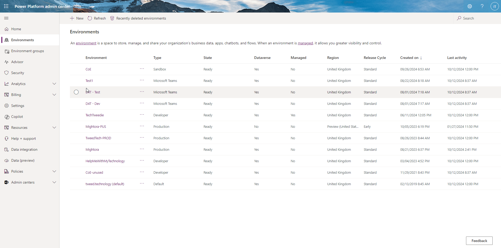
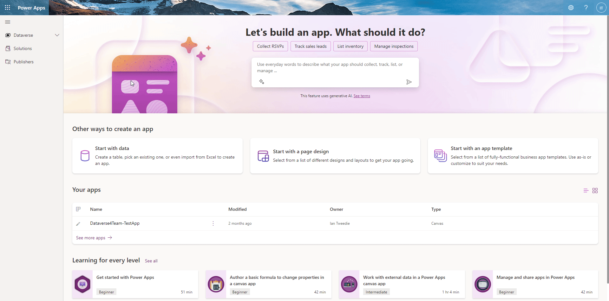
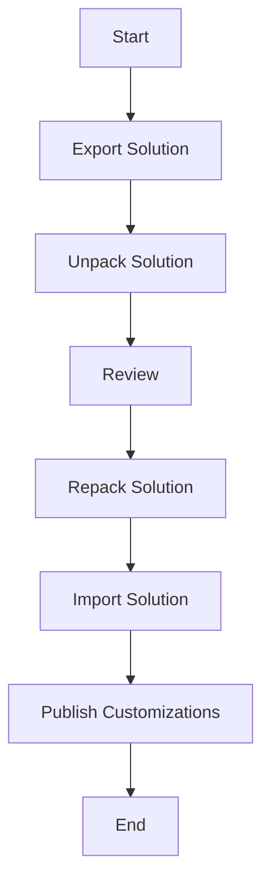

# Power Platform Dataverse 4 Teams Scripts

This repository contains PowerShell scripts for exporting, unpacking, importing, and publishing Power Platform solutions.

## Quick Start
For a full step by step set of instructions see the blog post here:

### Environment ID
1. Go to [https://admin.powerplatform.microsoft.com/environments](https://admin.powerplatform.microsoft.com/environments)
2. Click on your Dataverse 4 Teams Environment
3. Copy tour Environment ID


### Navigate to the Maker Portal & Web API Endpoint
1. Go to https://make.powerapps.com/environments/{copyed Environment ID}/home e.g. https://make.powerapps.com/environments/b50bfa1f-d077-e56f-aeaa-b9f92d3b79ad/home
2. Click on **Developer resources**
3. Copy your **Web API endpoint** e.g.https://orgef4d7f17.api.crm11.dynamics.com/



## Scripts

### Download From Source

This script exports a solution from a Power Platform environment, generates a solution settings template, and unpacks the solution along with any Canvas Apps it contains.

#### Parameters
- `-solutionName`: The name of the solution to export.
- `-exportDirectory`: The directory where the solution zip file will be exported.
- `-sourceEnv`: The source Power Platform environment from which the solution will be exported.
- `-unpackDirectory`: The directory where the solution will be unpacked and Canvas Apps will be processed.

#### Usage
```powershell
.\pipelineScripts\downloadFromSource.ps1 -solutionName "YourSolutionName" -exportDirectory "YourExportDirectory" -sourceEnv YourSourceEnvironmentID -unpackDirectory "YourUnpackDirectory"
```

e.g. Running from the root folder of this repo.
```powershell
.\pipelineScripts\downloadFromSource.ps1 -solutionName "Dataverse4TeamsDemo" -exportDirectory ".\demo\dataverse4TeamsDemo" -sourceEnv 1838fca4-6258-e6b8-a710-60838df81aa3 -unpackDirectory ".\demo\dataverse4TeamsDemo\unpacked"
```

### Release To Target

This script re-packs a solution from a local folder and pushes it to your target Power Platform environment. If no environment settings file is provided, the solution will be imported without additional settings. Canvas Apps are not re-packed during the push.

#### Parameters

- `-solutionName`: The name of the solution to process.
- `-unpackDirectory`: The directory where the solution is unpacked.
- `-environmentSettingsFile`: (Optional) The path to the environment settings file. If not provided, the solution will be imported without it.
- `-targetEnvironment`: The target Power Platform environment where the solution will be imported.

#### Usage

The script will connect to the target environment, re-pack the solution from the specified unpack directory, and then import the re-packed solution to the target environment. If an environment settings file is provided, it will be used during the import.

powershell
.\pipelineScripts\releaseToTarget.ps1 -solutionName "YourSolutionName" -unpackDirectory "path\to\unpack\directory" -environmentSettingsFile "path\to\settings\file" -targetEnvironment "yourTargetEnvironment"

#### Example:

```powershell
.\pipelineScripts\releaseToTarget.ps1 -solutionName "SolutionName" -unpackDirectory "YourUnpackDirectory" -exportDirectory "YourExportDirectory" -environmentSettingsFile "YourSettingsJsonFile" -targetEnvironment YourSourceEnvironmentID
```

e.g. Running from the root folder of this repo.

```powershell
.\pipelineScripts\releaseToTarget.ps1 -solutionName "Dataverse4TeamsDemo" -unpackDirectory ".\demo\dataverse4TeamsDemo\unpacked" -exportDirectory ".\demo\dataverse4TeamsDemo" -environmentSettingsFile ".\demo\settings.json" -targetEnvironment 5fc7b0a0-dc6e-e682-8886-bad6dac246a7
```


If you don't need to pass in a settings file:

```powershell
.\pipelineScripts\releaseToTarget.ps1 -solutionName "SolutionName" -unpackDirectory "YourUnpackDirectory" -exportDirectory "YourExportDirectory" -targetEnvironment YourSourceEnvironmentID
```

e.g. Running from the root folder of this repo.

```powershell
.\pipelineScripts\releaseToTarget.ps1 -solutionName "Dataverse4TeamsDemo" -unpackDirectory ".\demo\dataverse4TeamsDemo\unpacked" -exportDirectory ".\demo\dataverse4TeamsDemo" -targetEnvironment 5fc7b0a0-dc6e-e682-8886-bad6dac246a7
```

This script will handle re-packing your solution and importing it into your target environment. If you don't specify an environment settings file, the import will proceed without additional configuration settings.

## Diagram


## Adding as a Submodule

To add this repository as a submodule to another repository:

1. Navigate to the root directory of your target repository.
2. Run the following command to add the submodule:
    `git submodule add https://github.com/mightora/Power-Paltform-Dataverse4Teams-Tools.git scripts/dataverse4Teams`
3. Initialize and update the submodule:
    `git submodule update --init --recursive`

## Running the Scripts as a Submodule

Once the repository is added as a submodule, you can run the scripts from the submodule location.

### Download From Source
```powershell
.\pipelineScripts\downloadFromSource.ps1 -solutionName "YourSolutionName" -exportDirectory "YourExportDirectory" -unpackDirectory "YourUnpackDirectory"
```

### Release To Target
```powershell
.\scripts\dataverse4Teams\pipelineScripts\releaseToTarget.ps1 -solutionFilePath "path\to\your\solution.zip" -environmentName "YourEnvironmentName"
```

## Notes

- Ensure you have the required permissions and are authenticated with the correct environment before running the scripts.
- Update the paths and parameters according to your specific use case and environment setup.
