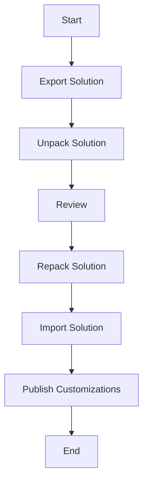

# Power Platform Dataverse 4 Teams Scripts

This repository contains PowerShell scripts for exporting, unpacking, importing, and publishing Power Platform solutions.

## Quick Start
For a full step by step set of instructions see the blog post here:

### Environment ID
1. Go to [https://admin.powerplatform.microsoft.com/environments](https://admin.powerplatform.microsoft.com/environments)
2. Click on your Dataverse 4 Teams Environment
3. Copy tour Environment ID


### Navigate to the Maker Portal & Web API Endpoint
1. Go to https://make.powerapps.com/environments/{copyed Environment ID}/home e.g. https://make.powerapps.com/environments/b50bfa1f-d077-e56f-aeaa-b9f92d3b79ad/home
2. Click on **Developer resources**
3. Copy your **Web API endpoint** e.g.https://orgef4d7f17.api.crm11.dynamics.com/


## Scripts Overview

### 1. Download From Source

This script exports a solution from a source environment, generates a solution settings template, and unpacks the solution, including any Canvas Apps it contains.

#### Parameters:

- `-solutionName`: The name of the solution to export.
- `-exportDirectory`: Directory where the solution's zip file will be exported.
- `-sourceEnv`: ID of the source environment from which to export the solution.
- `-unpackDirectory`: Directory where the solution will be unpacked and Canvas Apps will be processed.

#### Example Usage:

```powershell
.\pipelineScripts\downloadFromSource.ps1 -solutionName "Dataverse4TeamsDemo" -exportDirectory ".\demo\dataverse4TeamsDemo" -sourceEnv "1838fca4-6258-e6b8-a710-60838df81aa3" -unpackDirectory ".\demo\dataverse4TeamsDemo\unpacked"
```


### 2. Release to Target

This script re-packs a previously unpacked solution and imports it into a target environment. If an environment settings file is provided, the import will include those settings.

#### Parameters:

- `-solutionName`: Name of the solution to be processed.
- `-unpackDirectory`: Directory where the solution is unpacked.
- `-environmentSettingsFile`: (Optional) Path to the environment settings file.
- `-targetEnvironment`: Target environment to which the solution will be imported.
- `-exportDirectory`: Directory where the repacked solution will be exported.
- `-Managed`: Switch to indicate whether the solution should be managed.

#### Example Usage:

With a settings file:

```powershell
.\pipelineScripts\releaseToTarget.ps1 -solutionName "Dataverse4TeamsDemo" -unpackDirectory ".\demo\dataverse4TeamsDemo\unpacked" -exportDirectory ".\demo\dataverse4TeamsDemo" -environmentSettingsFile ".\demo\settings.json" -targetEnvironment "5fc7b0a0-dc6e-e682-8886-bad6dac246a7"
```

As Managed:

```powershell
.\pipelineScripts\releaseToTarget.ps1 -solutionName "Dataverse4TeamsDemo" -unpackDirectory ".\demo\dataverse4TeamsDemo\unpacked" -exportDirectory ".\demo\dataverse4TeamsDemo" -environmentSettingsFile ".\demo\settings.json" -targetEnvironment "5fc7b0a0-dc6e-e682-8886-bad6dac246a7" -managed
```

Without a settings file:

```powershell
.\pipelineScripts\releaseToTarget.ps1 -solutionName "Dataverse4TeamsDemo" -unpackDirectory ".\demo\dataverse4TeamsDemo\unpacked" -exportDirectory ".\demo\dataverse4TeamsDemo" -targetEnvironment "5fc7b0a0-dc6e-e682-8886-bad6dac246a7"
```


## Workflow Diagram




## Adding as a Submodule

You can add this repository as a submodule to your own repository to easily manage and update the scripts.

1. Navigate to the root directory of your target repository.
    
2. Run the following command:
    
    ```bash
    git submodule add https://github.com/mightora/Power-Paltform-Dataverse4Teams-Tools.git pipelineScripts
    ```
    
3. Initialize and update the submodule:
        
    `git submodule update --init --recursive`
    

## Running the Scripts as a Submodule

Once added as a submodule, you can run the scripts from their location within your repository.

### Download From Source:

```powershell
.\scripts\dataverse4Teams\pipelineScripts\downloadFromSource.ps1 -solutionName "YourSolutionName" -exportDirectory "YourExportDirectory" -unpackDirectory "YourUnpackDirectory"
```

### Release to Target:

```powershell
.\scripts\dataverse4Teams\pipelineScripts\releaseToTarget.ps1 -solutionName "YourSolutionName" -unpackDirectory "YourUnpackDirectory" -targetEnvironment "YourTargetEnvironmentID"
```


## Notes

- Ensure you have appropriate permissions and are authenticated with the correct environment before running these scripts.
- Update the paths and parameters according to your specific environment and project setup.
